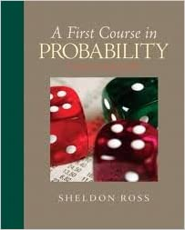

# A First Course in Probability - 8th Edition

This is a book for the fundamental introduction of Probability. It could be used for the high school students with Calculus skills.

* An introduction book for probability with a lot of examples. Good as a starter.
* Central Limited Theorem proof is not rigorous.
* Introduce Markov Chain, Stochastic Process and Monte Carlo Simulation  &#x20;
