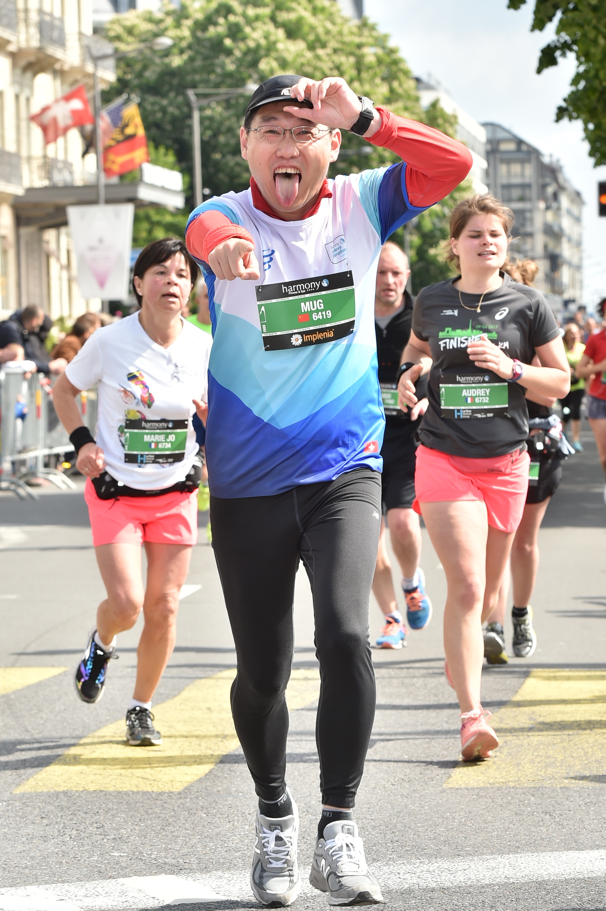

# Half Marathon in Geneva

This run is really nice. Start slowly at the end of the start line, follow pacemaker 2:10 in first 14 km and power up after that. Feel quite comfortable for the whole journey.&#x20;

And it is a nice downhill track for half marathon. I will strongly suggest this track for the first marathon runner.

